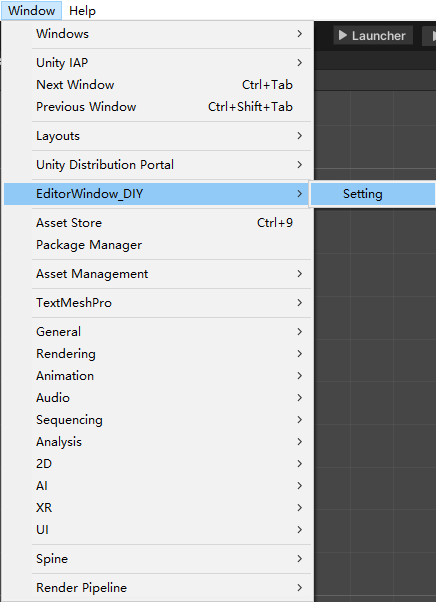

# **UnityEditorWindowDIY**

**2025年了，你还在用传统黑白编辑器界面吗？**  
**It's 2025, and you're still using the old black-and-white editor UI?**  

让我们用更酷、更灵活的方式，重新定义Unity编辑器的界面！通过这款工具，你可以轻松修改Unity编辑器，定制出属于你自己的独特界面体验！  
Let's redefine the Unity editor with a cooler and more flexible approach! With this tool, you can easily modify and customize the Unity editor to create a unique UI experience tailored to you!

**Principle**: Replacing function pointers via hooks to modify Unity Editor UI (MonoHook)

---

## ✨ Effect Demonstration
Here's a preview of how this modification will look after applying the hooks:

---

## 🛠️ Setup Instructions:

To set up and use this tool, follow the steps below:

1. **Step 1**  
   Download the repository and open it in your Unity project.

   

2. **Step 2**  
   Set the correct Unity version in your project settings, and ensure all dependencies are linked correctly.

   

---

## 🔧 Compatibility

This codebase is based on Unity version 6000.1.0b2, tested with Unity 2021. In theory, **MonoHook** should support any Unity version compatible with Mono.

---

## 🔮 Future Plans
We aim to enhance the tool to support additional editor UI modifications, including:

- More hooks for advanced customization.
- Enhanced compatibility with newer Unity versions.

---

## 💡 Credits

- **MonoHook**: An excellent hooking library.  
  [MonoHook GitHub](https://github.com/Misaka-Mikoto-Tech/MonoHook?tab=MIT-1-ov-file)

- **Unity Source**:  
  [Unity CsReference GitHub](https://github.com/Unity-Technologies/UnityCsReference)

---

## 🔄 How to Switch Unity Versions:

To switch between Unity versions while using this tool, follow these steps:

1. **Identify the Unity Version You Are Using**  
   Ensure that you have the correct Unity version installed (Unity 2021 or other supported versions).

2. **Modify the `UnityEditorWindowDIY` Project**  
   - Check the Unity version you're switching to.
   - Modify any project settings, dependencies, or references that are specific to a Unity version.
   - Ensure MonoHook supports the Unity version you're switching to.

3. **Test the Setup**  
   After switching versions, ensure everything works correctly by testing the editor UI modifications. This ensures that the hooks and customizations are still functional.

---

## 🌐 Community & Support

For any issues or feature requests, feel free to open an issue on the GitHub repository.

---

## 🚀 Quick Links
- **MonoHook GitHub**: [MonoHook Repository](https://github.com/Misaka-Mikoto-Tech/MonoHook?tab=MIT-1-ov-file)
- **Unity Source GitHub**: [Unity CsReference Repository](https://github.com/Unity-Technologies/UnityCsReference)

---
