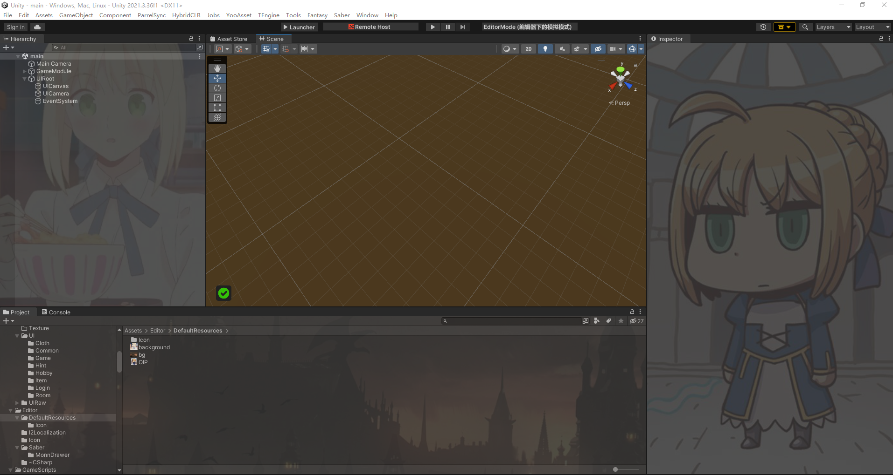

# UnityEditorWindowDIY
原理：通过函数指针替代，hook修改unity编辑器界面（MonoHook）

效果展示

如何设置:

本代码库根据Unity 6000.1.0b2版本源码制作,已验证Unity版本2021，理论上MonoHook支持版本都支持。

# 计划
支持更多编辑器部分修改

来自:

MonoHook：千星好用hook库[https://tryfinally.dev/detours-redirecting-csharp-methods-at-runtime](https://github.com/Misaka-Mikoto-Tech/MonoHook?tab=MIT-1-ov-file)

[Unity源码](https://github.com/Unity-Technologies/UnityCsReference)
